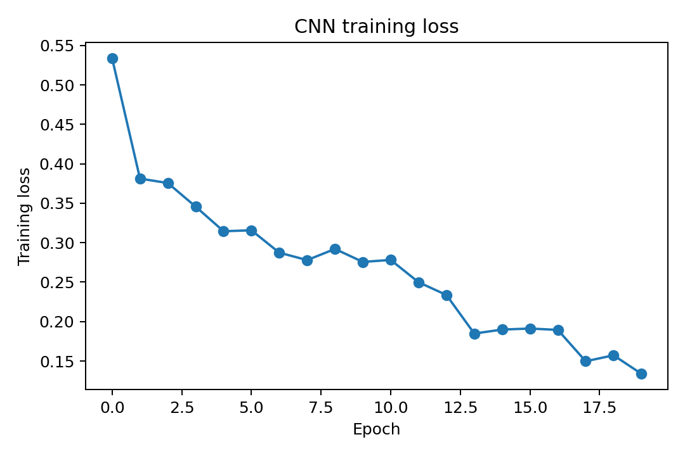
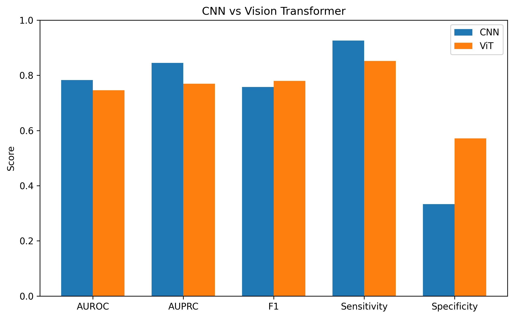
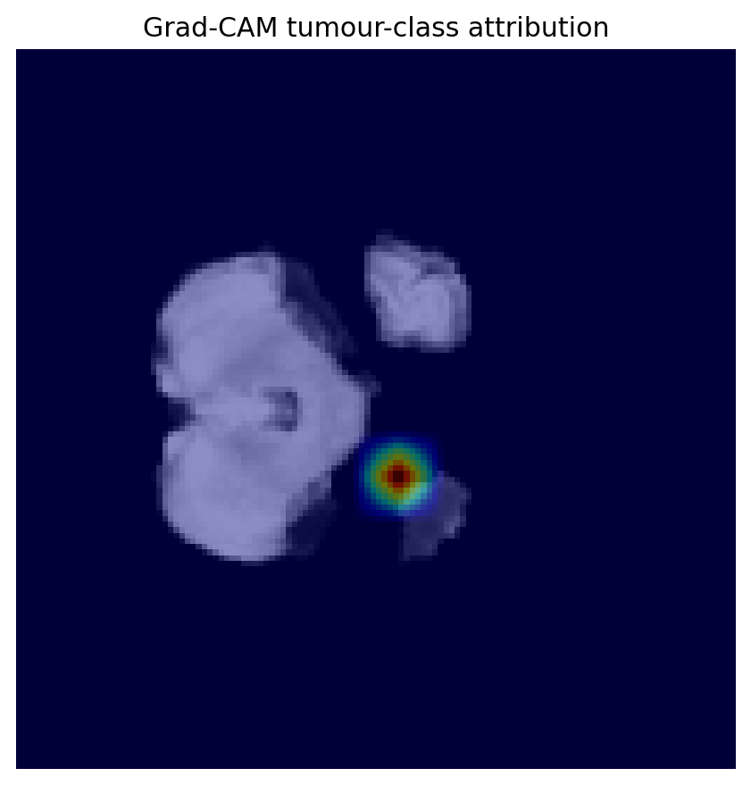
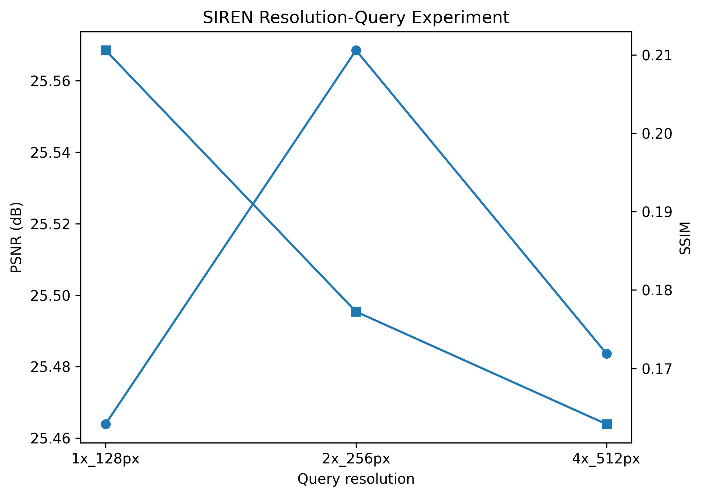
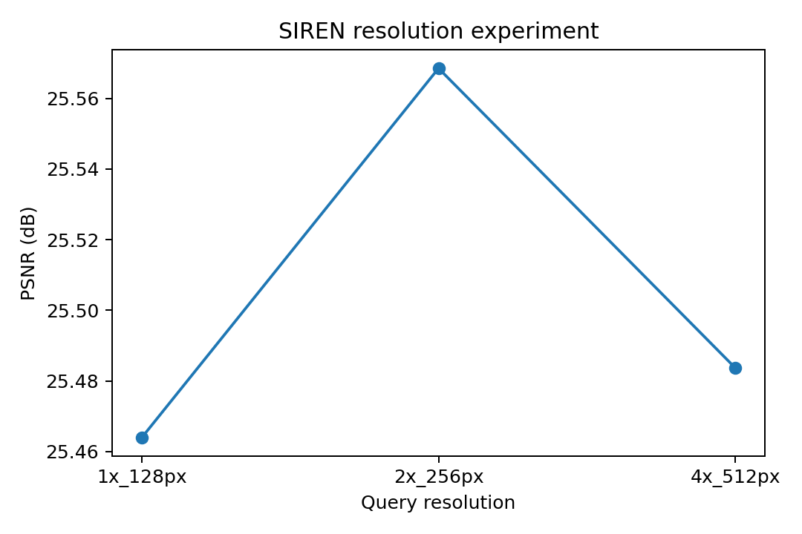
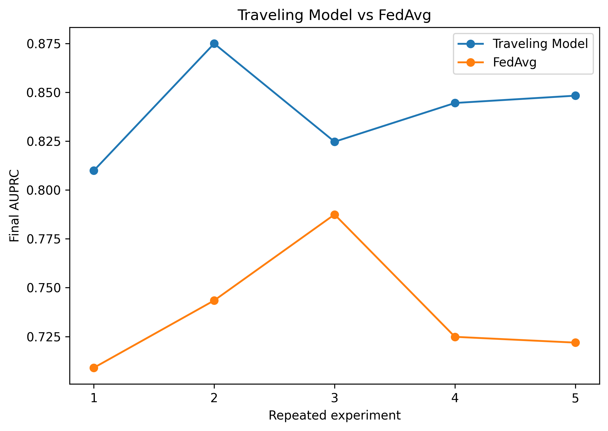
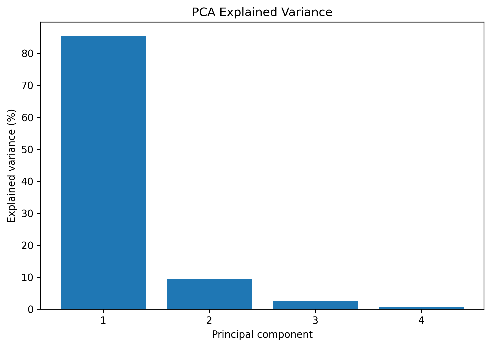
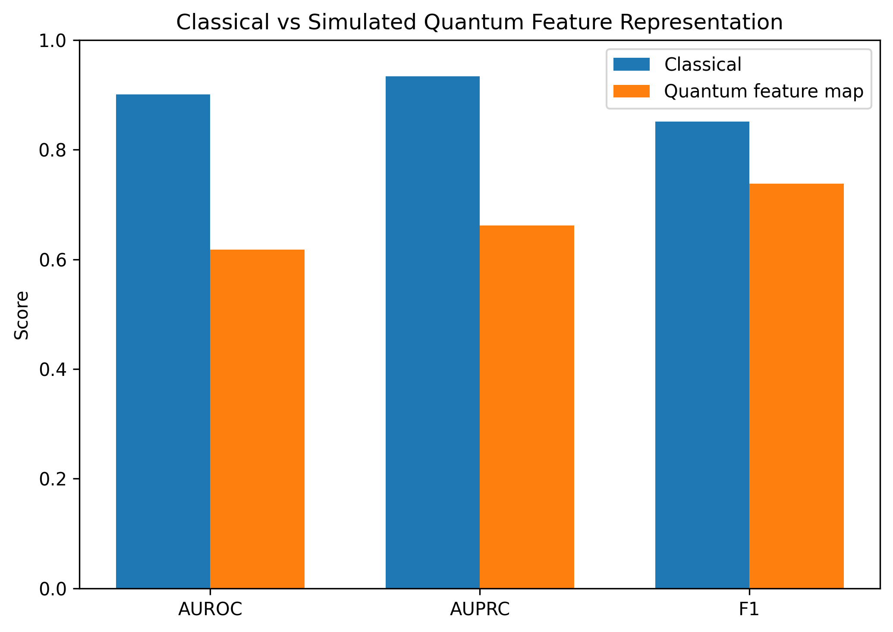

# NeuroINR-MONAI

**Resolution-Agnostic Multimodal Brain MRI Analysis with PyTorch, MONAI, Implicit Neural Representations, Explainability, and Distributed Learning**

NeuroINR-MONAI is a research-oriented medical imaging project that integrates multimodal brain MRI classification, implicit neural representations, explainability, statistical analysis, distributed-learning simulation, MATLAB interoperability, and an exploratory classically simulated quantum feature map in one reproducible PyTorch workflow.

The project was developed as an experimental computational biomedical imaging pipeline. It is intended for research use and is **not a clinical diagnostic system**.

---

## Overview

The project investigates several complementary questions in medical imaging:

- Can a CNN learn useful representations from multimodal brain MRI?
- How does a compact Vision Transformer behave on the same classification task?
- Can a brain MRI slice be represented as a continuous coordinate-based neural function?
- Can the same trained implicit neural representation be queried at multiple resolutions without retraining?
- Which image regions influence CNN predictions?
- How do Traveling Model and Federated Averaging strategies compare in a simulated decentralized setting?
- How much variance in learned features is captured by principal components?
- How does a simple classically simulated quantum-style feature map compare with a classical feature representation?

The final reported experiment used multimodal data from the **Medical Segmentation Decathlon Task01 BrainTumour** dataset and was executed on an **NVIDIA Tesla T4 GPU**.

---

## Main Components

- **Multimodal CNN classification**
- **Compact Vision Transformer baseline**
- **SIREN implicit neural representation**
- **Resolution-flexible coordinate querying**
- **Grad-CAM explainability**
- **Coordinate-level Shapley decomposition**
- **Traveling Model simulation**
- **Federated Averaging simulation**
- **Paired statistical testing**
- **PCA implemented through SVD**
- **Exploratory classically simulated quantum feature mapping**
- **MATLAB-compatible exports**
- **Automated tests**
- **Machine-readable experiment reporting**

---

## Project Architecture

```text
                         MULTIMODAL BRAIN MRI
                                  |
                                  v
                      Patient-Level Data Split
                                  |
                    +-------------+-------------+
                    |                           |
                    v                           v
               PyTorch CNN                Tiny Vision Transformer
                    |                           |
                    +-------------+-------------+
                                  |
                                  v
                           Classification
                                  |
                AUROC / AUPRC / F1 / Precision
                  Sensitivity / Specificity
                                  |
                                  v
                              Grad-CAM


                           FLAIR MRI SLICE
                                  |
                                  v
                               SIREN
                                  |
                                  v
                    f_theta(x, y) -> intensity
                                  |
                    +-------------+-------------+
                    |             |             |
                    v             v             v
                  128 px        256 px        512 px
                    |             |             |
                    +-------------+-------------+
                                  |
                             PSNR / SSIM


                     PATIENT-DISJOINT SITES
                                  |
                    +-------------+-------------+
                    |                           |
                    v                           v
              Traveling Model                FedAvg
                    |                           |
                    +-------------+-------------+
                                  |
                             Final AUPRC
                                  |
                         Paired t-test


                       LEARNED CNN FEATURES
                                  |
                                  v
                              PCA / SVD
                                  |
                    +-------------+-------------+
                    |                           |
                    v                           v
              Classical Features       Simulated Quantum
                                       Feature Embedding
```

---

## Technologies

- Python
- PyTorch
- CUDA
- MONAI
- NumPy
- SciPy
- pandas
- scikit-learn
- scikit-image
- Matplotlib
- Nibabel
- Grad-CAM
- SIREN
- PCA / SVD
- MATLAB `.mat` interoperability
- PyTest

---

## Dataset

The real-data workflow uses:

**Medical Segmentation Decathlon — Task01 BrainTumour**

The multimodal classifier uses four MRI channels:

1. FLAIR
2. T1-weighted MRI
3. contrast-enhanced T1-weighted MRI
4. T2-weighted MRI

The dataset itself is **not distributed with this repository**. Raw MRI volumes are excluded from version control.

---

## Experimental Configuration

| Parameter | Value |
|---|---:|
| Dataset | MSD Task01 BrainTumour |
| Patients used | 40 |
| MRI modalities | 4 |
| Image size | 128 × 128 |
| Slices per patient | 8 |
| Training slices | 224 |
| Validation slices | 48 |
| Test slices | 48 |
| CNN epochs | 20 |
| ViT epochs | 5 |
| SIREN optimization steps | 500 |
| Distributed sites | 4 |
| Distributed rounds | 6 |
| Local training steps | 30 |
| Distributed repetitions | 5 |
| Hardware | NVIDIA Tesla T4 |
| Runtime device | CUDA |

Patient-level splitting is used to reduce leakage between training and held-out evaluation partitions.

---

# Results

## Multimodal CNN

The primary CNN receives four MRI channels and performs binary slice-level classification.

Final held-out test performance:

| Metric | Result |
|---|---:|
| AUROC | **0.7831** |
| AUPRC | **0.8454** |
| F1 | **0.7576** |
| Precision | 0.6410 |
| Sensitivity | **0.9259** |
| Specificity | 0.3333 |
| Validation-selected threshold | 0.1473 |

The operating threshold was selected using validation predictions and then applied to the held-out test set. This avoids choosing the classification threshold directly from test performance.

### CNN Training Loss



---

## CNN vs Vision Transformer

A compact Vision Transformer was trained as an additional architecture baseline.

| Metric | CNN | Vision Transformer |
|---|---:|---:|
| AUROC | 0.7831 | 0.7460 |
| AUPRC | 0.8454 | 0.7698 |
| F1 | 0.7576 | 0.7797 |
| Precision | 0.6410 | 0.7188 |
| Sensitivity | 0.9259 | 0.8519 |
| Specificity | 0.3333 | 0.5714 |

The two architectures show different operating characteristics rather than a uniform advantage across every metric.



---

## Grad-CAM Explainability

Grad-CAM is used to visualize image regions that influence the CNN tumor-class prediction.



The heatmap should **not** be interpreted as a validated tumor segmentation mask. It represents model attribution, not a clinically validated lesion boundary.

---

# Implicit Neural Representation

The project implements a SIREN-style implicit neural representation. Instead of storing an image only as a fixed pixel grid, the model learns a continuous coordinate-based function:

```text
f_theta(x, y) -> intensity
```

where `(x, y)` are spatial coordinates and the output is image intensity.

The same trained SIREN can therefore be queried at different coordinate-grid densities without retraining the network.

---

## Resolution Query Experiment

The trained SIREN was queried at three output resolutions:

- 128 × 128
- 256 × 256
- 512 × 512

| Query Resolution | PSNR | SSIM |
|---|---:|---:|
| 128 × 128 | 25.4639 dB | 0.2106 |
| 256 × 256 | 25.5685 dB | 0.1772 |
| 512 × 512 | 25.4836 dB | 0.1629 |



A PSNR-only visualization is also included:



PSNR remained relatively stable across the three query resolutions while SSIM decreased at denser coordinate grids.

This experiment demonstrates **continuous-coordinate, resolution-flexible querying**. It is **not presented as learned super-resolution**, and higher query resolution should not be interpreted as recovery of new anatomical information.

---

## Coordinate-Level Shapley Example

The INR module also includes a two-feature coordinate-level Shapley decomposition.

```text
phi_x = -0.01193
phi_y =  0.00799
efficiency error = 0.0
```

The zero efficiency error confirms consistency of the implemented decomposition for the tested coordinate.

These values describe contributions of the coordinate inputs to the INR output and are **not equivalent to clinical feature-level SHAP analysis**.

---

# Distributed Learning Simulation

To explore decentralized training, the project compares:

- **Traveling Model**
- **Federated Averaging (FedAvg)**

The simulated sites are patient-disjoint partitions of the available training data. They are **not real hospitals**.

## Traveling Model vs FedAvg

Final AUPRC values across five paired repetitions:

### Traveling Model

```text
0.8099
0.8750
0.8247
0.8446
0.8483
```

### FedAvg

```text
0.7090
0.7434
0.7875
0.7248
0.7219
```

Paired statistical analysis:

| Statistic | Result |
|---|---:|
| Mean AUPRC difference | 0.1032 |
| t-statistic | 5.9710 |
| p-value | 0.00395 |
| 95% CI | [0.0552, 0.1512] |
| Paired repetitions | 5 |



Within this simulation, the Traveling Model runs produced higher final AUPRC than the FedAvg runs. Because this is a small simulated experiment, the result should **not** be interpreted as evidence that Traveling Model training is universally superior in real clinical federated-learning settings.

---

# PCA / SVD Analysis

Principal component analysis is implemented through singular value decomposition of learned CNN feature embeddings.

| Principal Component | Explained Variance |
|---|---:|
| PC1 | 85.52% |
| PC2 | 9.38% |
| PC3 | 2.44% |
| PC4 | 0.65% |

The first four components explain approximately **97.98%** of the analyzed variance.



---

# Exploratory Quantum Feature Mapping

The project includes an exploratory, **classically simulated** quantum-style feature embedding.

No quantum hardware was used. No claim of quantum advantage is made.

| Metric | Classical Representation | Simulated Quantum Feature Map |
|---|---:|---:|
| AUROC | 0.9007 | 0.6180 |
| AUPRC | 0.9338 | 0.6623 |
| F1 | 0.8515 | 0.7385 |
| Precision | 0.8113 | 0.5854 |
| Sensitivity | 0.8958 | 1.0000 |
| Specificity | 0.7059 | 0.0000 |



In this experiment, the classical representation produced stronger AUROC and AUPRC than the simulated quantum embedding.

---

# MATLAB Interoperability

The pipeline exports selected experiment outputs as MATLAB-compatible `.mat` files.

```text
results/matlab_exports/
├── gradcam_example.mat
├── resolution_experiment.mat
└── summary_metrics.mat
```

The repository also includes:

```text
matlab/view_reconstructions.m
```

for MATLAB-based inspection of reconstruction outputs.

---

# Repository Structure

```text
NeuroINR-MONAI/
│
├── configs/
│   └── config.yaml
│
├── matlab/
│   └── view_reconstructions.m
│
├── results/
│   ├── report.json
│   │
│   ├── checkpoints/
│   │   ├── cnn_brain_mri.pt
│   │   └── siren_mri.pt
│   │
│   ├── figures/
│   │   ├── classical_vs_quantum.png
│   │   ├── cnn_training_loss.png
│   │   ├── cnn_vs_vit.png
│   │   ├── gradcam.png
│   │   ├── pca_explained_variance.png
│   │   ├── siren_resolution_psnr.png
│   │   ├── siren_resolution_psnr_ssim.png
│   │   └── traveling_vs_fedavg.png
│   │
│   └── matlab_exports/
│       ├── gradcam_example.mat
│       ├── resolution_experiment.mat
│       └── summary_metrics.mat
│
├── src/
│   ├── data/
│   │   ├── dataset.py
│   │   └── synthetic_fallback.py
│   ├── explainability/
│   │   ├── coordinate_shapley.py
│   │   └── gradcam.py
│   ├── federated/
│   │   └── traveling_model.py
│   ├── models/
│   │   ├── cnn.py
│   │   ├── siren.py
│   │   └── vit.py
│   ├── quantum/
│   │   └── quantum_feature_map.py
│   ├── stats/
│   │   └── matrix_stats.py
│   ├── training/
│   │   ├── train_cnn.py
│   │   └── train_inr.py
│   └── utils/
│       ├── matlab_export.py
│       └── metrics.py
│
├── tests/
│   └── test_pipeline.py
│
├── .gitignore
├── LICENSE
├── requirements.txt
└── run_pipeline.py
```

---

# Installation

Clone the repository:

```bash
git clone https://github.com/Saadalishah107/NeuroINR-MONAI.git
cd NeuroINR-MONAI
```

Install dependencies:

```bash
pip install -r requirements.txt
```

A CUDA-capable GPU is recommended for the real-data experiment.

---

# GPU Check

```python
import torch

print("PyTorch:", torch.__version__)
print("CUDA available:", torch.cuda.is_available())

if torch.cuda.is_available():
    print("GPU:", torch.cuda.get_device_name(0))
```

---

# Automated Testing

Run:

```bash
pytest tests/test_pipeline.py -v
```

The test suite covers the major pipeline components, including:

- CNN forward propagation
- four-channel multimodal input
- Vision Transformer forward propagation
- SIREN coordinate querying
- image-quality metrics
- Grad-CAM
- coordinate-level Shapley efficiency
- PCA / SVD
- paired statistical testing
- simulated quantum feature embedding
- MATLAB export
- distributed-learning execution

The final repository package was validated successfully with the automated test suite before upload.

---

# Running the Pipeline

## 1. Synthetic Smoke Test

Use this first to verify that the software stack runs end-to-end without requiring the medical dataset.

```bash
python run_pipeline.py \
    --quick \
    --synthetic_fallback
```

Synthetic-data output is intended only for software validation and should not be interpreted as medical model performance.

## 2. Small FLAIR Real-Data Test

```bash
python run_pipeline.py \
    --real_quick \
    --modality_mode flair \
    --limit_patients 12
```

## 3. Small Multimodal Real-Data Test

```bash
python run_pipeline.py \
    --real_quick \
    --modality_mode multimodal \
    --limit_patients 12
```

## 4. Main Multimodal Experiment

The reported experiment was run with:

```bash
python run_pipeline.py \
    --modality_mode multimodal \
    --limit_patients 40 \
    --run_vit
```

The full workflow includes:

1. dataset loading
2. patient-level splitting
3. multimodal CNN training
4. Vision Transformer comparison
5. SIREN training
6. multi-resolution INR querying
7. Grad-CAM attribution
8. coordinate-level Shapley analysis
9. Traveling Model simulation
10. FedAvg simulation
11. paired statistical analysis
12. PCA / SVD
13. exploratory quantum-style feature mapping
14. MATLAB export
15. JSON report generation

---

# Output Organization

A new experiment writes runtime artifacts under:

```text
outputs/
```

Typical generated outputs include:

```text
outputs/
├── report.json
├── checkpoints/
├── figures/
└── matlab_exports/
```

The runtime `outputs/` directory is excluded from version control.

Selected final experiment artifacts are stored under:

```text
results/
```

for reproducibility and repository presentation.

---

# Machine-Readable Results

The complete final experiment report is stored at:

```text
results/report.json
```

It records:

- runtime device
- modality configuration
- CNN validation metrics
- CNN test metrics
- Vision Transformer results
- SIREN resolution metrics
- coordinate Shapley values
- Traveling Model results
- FedAvg results
- paired statistical analysis
- PCA explained variance
- classical feature performance
- simulated quantum feature performance
- experiment settings

---

# Reproducibility

The project supports reproducibility through:

- modular source-code organization
- command-line execution
- explicit experiment parameters
- patient-level splitting
- validation-based threshold selection
- automated testing
- saved final metrics
- saved final figures
- saved model checkpoints
- MATLAB-compatible exports
- machine-readable JSON reporting

---

# Limitations

### Dataset Scale

The reported experiment uses a 40-patient subset rather than the complete available dataset. The metrics should therefore not be interpreted as definitive estimates of clinical generalization.

### 2D Slice-Based Analysis

The classification pipeline operates on selected two-dimensional MRI slices. Full three-dimensional anatomical context is not modeled.

### External Validation

The models were not evaluated on an independent external clinical cohort. External validation would be necessary before broader claims about generalization.

### Sensitivity-Specificity Tradeoff

The CNN achieved high sensitivity but relatively low specificity at the validation-selected threshold. Further calibration and operating-point analysis would be required for more complete evaluation.

### Vision Transformer Training

The compact Vision Transformer was trained for a limited number of epochs and was not subjected to extensive architecture or hyperparameter optimization.

### Implicit Neural Representation

The SIREN experiment demonstrates continuous coordinate-based representation and resolution-flexible querying. It is not a learned super-resolution system.

### Explainability

Grad-CAM identifies regions that influence the classifier. It is not equivalent to a validated tumor segmentation mask. Coordinate-level Shapley values describe INR coordinate contributions and should not be interpreted as patient-level clinical feature importance.

### Distributed Learning

The decentralized experiments are simulations. They do not reproduce real hospital infrastructure, regulatory constraints, communication failures, imaging-protocol heterogeneity, or institution-specific distribution shifts.

### Statistical Power

The Traveling Model vs FedAvg comparison uses five paired repetitions. Larger repeated experiments would provide stronger statistical evidence.

### Quantum Experiment

The quantum-style feature map is simulated classically. No quantum hardware was used and no quantum advantage was demonstrated.

### Clinical Use

The project has not undergone clinical validation, regulatory review, or prospective evaluation. It should not be used for diagnosis or treatment decisions.

---

# Future Work

Potential extensions include:

- full-cohort experiments
- repeated grouped cross-validation
- 3D CNN architectures
- 3D MONAI models
- volumetric Vision Transformers
- joint classification and tumor segmentation
- external-dataset validation
- probability calibration
- Brier score analysis
- temperature scaling
- sensitivity-specificity operating-point analysis
- modality-specific encoders
- attention-based multimodal fusion
- Fourier-feature INRs
- multiscale implicit neural representations
- 3D coordinate networks
- tumor-region reconstruction metrics
- advanced federated-learning frameworks
- non-IID site simulation
- differential privacy
- secure aggregation
- Integrated Gradients
- DeepLIFT
- classifier-level SHAP
- bootstrap confidence intervals
- permutation testing
- larger repeated distributed experiments
- hybrid quantum-classical experiments if appropriate hardware becomes available

---

# Key Results Summary

| Component | Main Result |
|---|---|
| CNN | AUROC = 0.7831 |
| CNN | AUPRC = 0.8454 |
| CNN | Sensitivity = 0.9259 |
| Vision Transformer | AUROC = 0.7460 |
| Vision Transformer | AUPRC = 0.7698 |
| SIREN 128 px | PSNR = 25.4639 dB |
| SIREN 256 px | PSNR = 25.5685 dB |
| SIREN 512 px | PSNR = 25.4836 dB |
| Traveling vs FedAvg | Mean AUPRC difference = 0.1032 |
| Distributed comparison | p = 0.00395 |
| PCA | First four PCs explain ~97.98% |
| Classical representation | AUROC = 0.9007 |
| Simulated quantum feature map | AUROC = 0.6180 |

---

# Research Scope

NeuroINR-MONAI combines multiple areas of computational biomedical research:

- medical imaging
- neuroimaging
- multimodal MRI
- deep learning
- convolutional neural networks
- Vision Transformers
- MONAI
- PyTorch
- GPU computing
- implicit neural representations
- SIREN
- explainable AI
- Grad-CAM
- Shapley attribution
- distributed learning
- Federated Averaging
- statistical analysis
- PCA
- SVD
- MATLAB interoperability
- exploratory quantum machine learning

The project emphasizes reproducible implementation, transparent evaluation, and careful reporting of limitations.

---

# Author

**Syed Muhammad Saad Ali Shah**

GitHub: [Saadalishah107](https://github.com/Saadalishah107)

---

# License

This project is released under the terms provided in the repository's [LICENSE](LICENSE) file.
